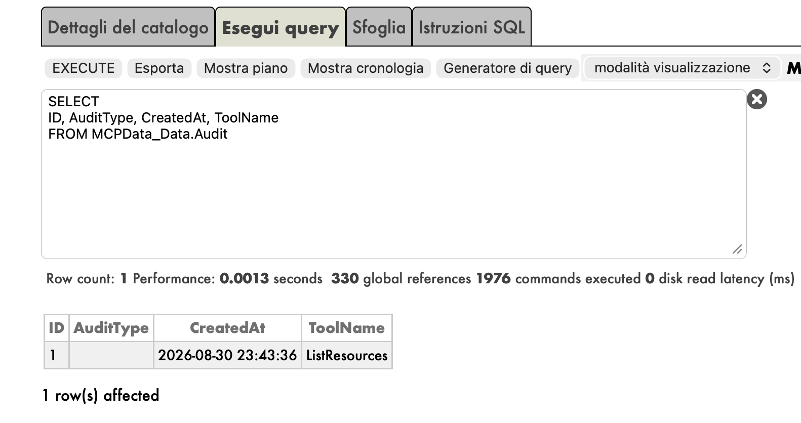
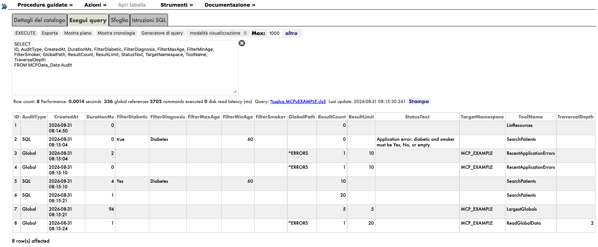
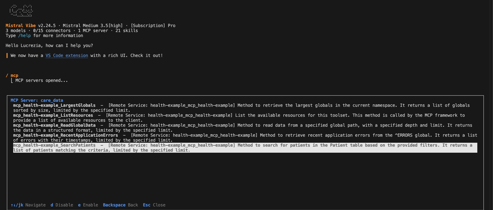
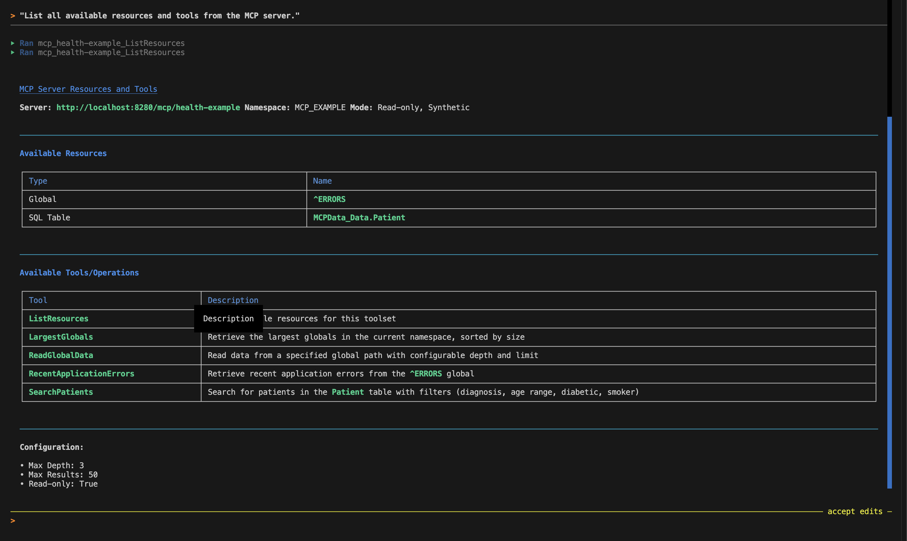
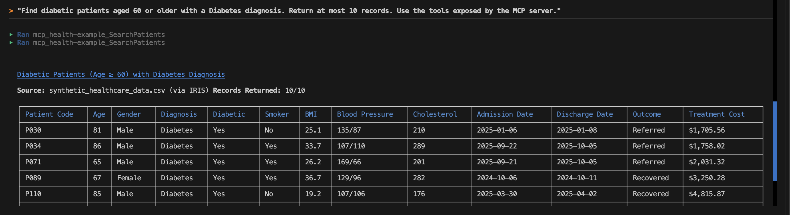
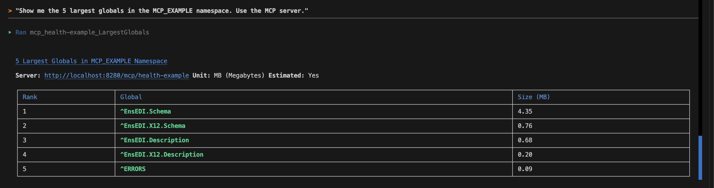
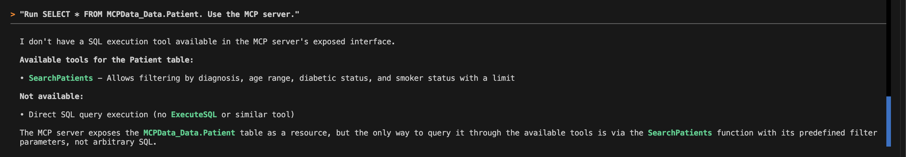
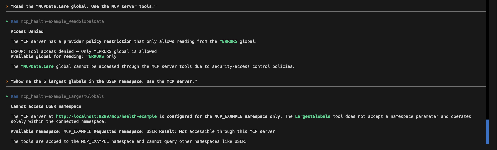

# MCP Data Exposure Toolkit

A runnable example of how to give AI agents controlled access to InterSystems IRIS data through the Model Context Protocol (MCP). Built with AI Hub and ObjectScript, it includes tools for searching synthetic patient records, reading a selected global, and checking namespace health.

For implementation details, credentials, role configuration, and client examples, see the [Developer Guide](dev.md).

## Table of contents

- [How this project was born](#how-this-project-was-born)
- [How it works](#how-it-works)
- [Security model](#security-model)
- [Run](#run)
- [Connect and verify](#connect-and-verify)
- [Exposed tools](#exposed-tools)
- [Try it with an agent](#try-it-with-an-agent)
- [Synthetic patient dataset](#synthetic-patient-dataset)
- [Adapt it to your data](#adapt-it-to-your-data)

## How this project was born

I created this project for the InterSystems [Community Bounty Program “Idea to Application” — Round 2](https://community.intersystems.com/post/community-bounty-program-idea-application-%E2%80%94-round-2-live), in response to the [MCP Data Exposure Toolkit idea (DPI-I-985)](https://ideas.intersystems.com/ideas/DPI-I-985).

The idea asked for examples of exposing IRIS data through MCP using AI Hub, with particular attention to sensitive data and access control.

I chose a healthcare example using synthetic patient records, alongside a few tools for inspecting the local IRIS namespace. That gave me a way to show both SQL and global access without including real patient data.

I obtained the IRIS Docker image through the instructions in the [InterSystems AI Hub Early Access Program repository](https://github.com/intersystems-community/ai-hub-eap), which also provides the AI Hub documentation and samples used as a starting point.

### What I built

An agent can discover the available tools and data sources, then use them through one MCP endpoint. It can filter patient records, read the `^ERRORS` global, or request a short error summary. It cannot send its own SQL or choose another global or namespace.

The access rules live in IRIS: a dedicated user and role, limits on each tool, and shared authorization and audit policies. Docker Compose and client examples let you try the setup locally, then adapt the tools to your own data.

The examples cover SQL, globals, and operational data. There is no DocDB template yet.

## How it works

The tools are methods in an ObjectScript class that extends `%AI.Tool`. A `%AI.ToolSet` class groups them and attaches the authorization and audit policies; `%AI.MCP.Service` registers the service inside IRIS.

External clients connect through the EAP's `iris-mcp-server` binary, which provides the Streamable HTTP transport and forwards requests to IRIS over port `1972`. It runs in the separate `mcp` container so its startup and logs stay separate from the database. That container runs only the bridge, not a second IRIS instance.

```text
MCP client (on your machine)
  |
  | Streamable HTTP: http://localhost:8280/mcp/health-example
  | Docker maps host port 8280 to container port 8080
  v
iris-mcp-server (in the mcp container)
  |
  | Native connection to iris:1972 over the Compose network
  v
IRIS (in the iris container, namespace MCP_EXAMPLE)
  -> MCPData.Service.HealthExample    selects the ToolSet
  -> MCPData.ToolSet.HealthExample    attaches authorization and audit policies
  -> MCPData.Tools.HealthExample      executes the requested ObjectScript method
```

The client connects only to port `8280`. Here, `iris` in `iris:1972` is the Compose service name, resolved inside Docker—not a second HTTP URL. The bridge forwards the request to the registered IRIS MCP application; the service, ToolSet, and tool class are ObjectScript classes within that same IRIS instance, not additional network services. The result returns to the client through the bridge.

Host port `9291` also maps to IRIS port `1972` for direct development access, but it is not used in this MCP request path.

## Security model

Sensitive access is controlled at several layers:

- The endpoint user receives only the `MCPDataReader` role.
- The role receives `SELECT` only on `MCPData_Data.Patient`; database-resource access alone does not bypass IRIS SQL privileges.
- The authorization policy permits only five named tools.
- Tools accept filters and approved paths, not arbitrary SQL or global names.
- Query results, traversal depth, and monitoring results have hard limits.
- Monitoring stays inside the `MCP_EXAMPLE` namespace and cannot inspect the full IRIS instance.
- The audit policy records tool name, status, duration, and bounded result metadata.

Audit records can be inspected in the IRIS Management Portal. This example queries `MCPData_Data.Audit` and shows a recorded `ListResources` call with its timestamp.



The fuller example below shows SQL and global tool calls recorded separately, with filters or paths, execution time, and returned counts—not full patient records. The failed `SearchPatients` call also has an entry: an invalid `diabetic` value is captured in `StatusText`, while a valid call records its filters and result count. Auditing covers failed executions as well as successful reads; fields unrelated to a tool remain empty.



### Credentials

- `APP_USER` and `APP_PASS` authenticate the MCP client. Setup creates this dedicated user (default `mcp_reader`) with the `MCPDataReader` role.
- `WG_USER` and `WG_PASS` authenticate the bridge's internal connection to IRIS. This demo uses the privileged `CSPSystem` account. Never give these credentials to an MCP client or reuse them for the endpoint user.

### Development limits

This is a local development example built on pre-release software. The [AI Hub EAP documentation](https://github.com/intersystems-community/ai-hub-eap#readme) states that the software is not intended for production. The demo uses HTTP Basic authentication over local HTTP and development credentials; do not expose it to an untrusted network. A deployment with real data would require a separate review of TLS, credentials, network exposure, data minimization, and privileges.

## Run

### Prerequisites

- Docker with Docker Compose.
- The AI Hub EAP IRIS image, obtained using the [upstream download and installation instructions](https://github.com/intersystems-community/ai-hub-eap#accessing-the-software). Load the downloaded image into Docker before building. The [Dockerfile](Dockerfile) currently targets `2026.3.0AI.136.0`; make sure its base-image reference matches the image and architecture you downloaded.
- A local `.env` file copied from `.env.example`. Review `WG_USER`, `WG_PASS`, `APP_USER`, and `APP_PASS` before starting; keep gateway and endpoint identities separate.

### Start the example

**VS Code users:** Open this project folder and run the **MCP - Docker: Build and Start** task from **Tasks: Run Task**.

**Command line users:** Run from the project directory:

```bash
docker compose up -d --build --wait --wait-timeout 180 iris
docker compose exec iris iris session IRIS -U MCP_EXAMPLE '##class(MCPData.Setup).ConfigureUsers()'
docker compose up -d mcp
```

This sequence starts IRIS, configures the dedicated endpoint user and SQL grant from `.env`, and then starts the MCP bridge. Use a dedicated demo account for `APP_USER`: setup recreates that user if it already exists.

- MCP URL: <http://localhost:8280/mcp/health-example>
- IRIS Portal: <http://localhost:9292/csp/sys/UtilHome.csp> (default credentials: username `_SYSTEM`, password `SYS`).

The MCP URL is a protocol endpoint, not a browser user interface. Test it with VS Code or another MCP client using the configurations in [`dev.md`](dev.md).

## Connect and verify

After running the build task, verify the IRIS container is running and the user defined in the `APP_USER` variable of `.env` has the `MCPDataReader` role.

A correct connection discovers these five public MCP tool names:

```text
mcp_health-example_ListResources
mcp_health-example_SearchPatients
mcp_health-example_ReadGlobalData
mcp_health-example_LargestGlobals
mcp_health-example_RecentApplicationErrors
```

Here is the same set of five tools discovered in Mistral Vibe:



An optional Python smoke test verifies authentication, checks that all five tools are discoverable, invokes every tool with small bounded inputs, and prints each structured response:

```bash
uv venv --python 3.12
source .venv/bin/activate
uv pip install -r requirements.txt
set -a
source .env
set +a
python test_mcp.py
```

The test checks the exact public names above and prints results from all five tools. It exits with status `1` when authentication, discovery, or invocation fails.

VS Code users can also run **MCP - Docker: Cleanup Everything** or **MCP - Open: IRIS Management Portal** from **Tasks: Run Task**. Cleanup removes the project's containers, networks, volumes, and service images; treat it as destructive cleanup of the local demo.

## Exposed tools

- `ListResources`: describes the approved data sources, read-only operations, and result limits.
- `SearchPatients`: searches imported patient records by diagnosis, diabetic status, smoker status, and age range. It accepts scalar filters only and returns at most 50 rows per call. `row_count` counts the returned rows, not the table's contents; `applied_limit` reports the enforced limit. `truncated: true` means more matching rows exist. A false flag means all matches for the supplied filters were returned—not necessarily the whole table. The 50-row cap is per call, not a cumulative access limit.
- `ReadGlobalData`: reads the `^ERRORS` global with bounded depth and result count.
- `LargestGlobals`: top 1-20 globals visible in `MCP_EXAMPLE`, using native `%SYS.GlobalQuery`; system globals and mapped subscript ranges are excluded.
- `RecentApplicationErrors`: latest 1-20 `MCP_EXAMPLE` application errors from `^ERRORS`; returns only ID, timestamp, and error text. Stack, variables, usernames, and object data stay hidden.

## Try it with an agent

Ask your agent to use this MCP server rather than local files or other data sources. These prompts show what it can do and where the limits apply. The server enforces those limits in code and permissions, not through prompt instructions.

### Supported requests

| Capability | Example Prompt | Result |
|-----------|---------------|--------|
| List available tools | "List all available resources and tools from the MCP server." | MCP discovery exposes five tools; `ListResources` describes their data sources and limits |
| Query patient data | "Find diabetic patients aged 60 or older with a Diabetes diagnosis. Return at most 10 records. Use the tools exposed by the MCP server." | Returns filtered patient results (max 50 rows) |
| Read error log | "Get the 10 most recent application errors from MCP_EXAMPLE. Use the tools exposed by the MCP server." | Returns redacted errors (ID, timestamp, text only) |
| Read ^ERRORS global | "Read the ERRORS global at path ^ERRORS with depth 2 and limit 20. Use the MCP server tools." | Returns bounded global traversal |
| Monitor namespace | "Show me the 5 largest globals in the MCP_EXAMPLE namespace. Use the MCP server." | Returns top globals by size |

Examples from an agent session:

`ListResources` describes the available data sources and their limits.



`SearchPatients` returns synthetic patient records matching the requested diagnosis and age filters.



`LargestGlobals` reports estimated global sizes within `MCP_EXAMPLE`.



### Requests outside the tool limits

| Attempt | Example Prompt | Result |
|---------|---------------|--------|
| Arbitrary SQL | "Run SELECT * FROM MCPData_Data.Patient. Use the MCP server." | **Unsupported**: No tool accepts SQL; patient access uses the fixed `SearchPatients` query |
| Non-allowlisted global | "Read the ^MCPData.Care global. Use the MCP server tools." | **Denied**: Only ^ERRORS global is allowed |
| Cross-namespace access | "Show me the 5 largest globals in the USER namespace. Use the MCP server." | **Unsupported**: Monitoring has no namespace selector and stays inside MCP_EXAMPLE |
| Unbounded results | "Find all patients without a limit. Use the MCP server." | **Bounded**: The default limit applies when omitted; requested limits above 50 are clamped |
| Arbitrary table access | "List all tables in the database. Use the MCP server." | **Unsupported**: No general schema-discovery tool is exposed |

An agent may explain that a request is unsupported or use a supported tool instead. Data-retrieval tools do not modify data; the audit policy writes execution metadata separately.

For an arbitrary SQL request, the agent explains that no SQL execution tool is available and points to `SearchPatients` instead.



Reading a non-allowlisted global produces an access-denied error. The same session also shows the agent explaining why monitoring cannot target the `USER` namespace.



## Synthetic patient dataset

The project imports all 500 records from [`data/synthetic_healthcare_data.csv`](data/synthetic_healthcare_data.csv) during container installation. The source is [Synthetic Healthcare Patient Records Dataset by dnation on Kaggle](https://www.kaggle.com/datasets/dnation/synthetic-healthcare-patient-records-dataset).

Each record contains a patient code, age, gender, BMI, blood pressure, cholesterol level, smoker and diabetic status, diagnosis, treatment cost, admission and discharge dates, and outcome. There are no real patient records or names.

`MCPData.Data.Patient` is the only patient class and patient table. Its importer separates blood pressure into systolic and diastolic columns and converts dates and yes/no fields to native IRIS types.

## Adapt it to your data

Start with the example closest to your data source:

1. Adapt `SearchPatients` with a fixed query, typed scalar filters, and only the output fields the agent needs.
2. Adapt `ReadGlobalData` with an explicit allowlist and bounded traversal. Use a purpose-built response when raw values could disclose sensitive information.
3. Update `ListResources`, tool descriptions, authorization rules, and IRIS grants so discovery and execution describe the same approved surface.
4. Extend the tests to cover both permitted calls and attempts outside that surface, and review what the audit policy records.

See the [Developer Guide](dev.md) for the class layout and configuration details.
